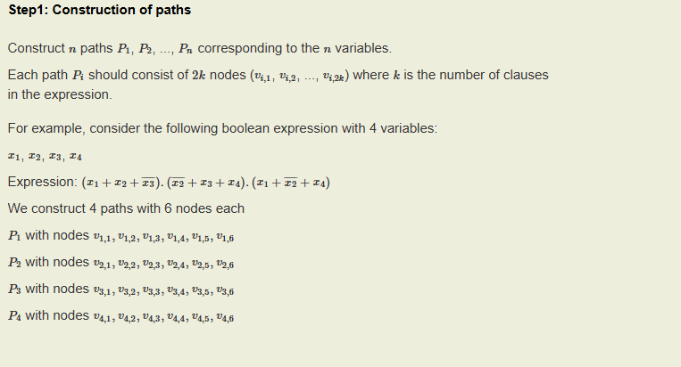
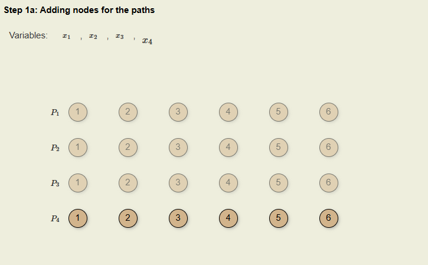
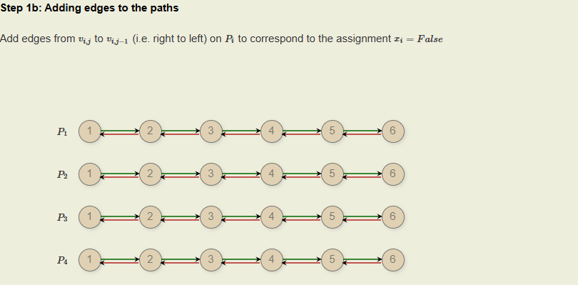
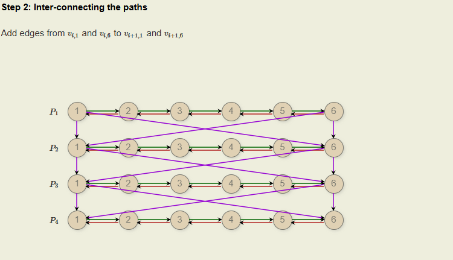
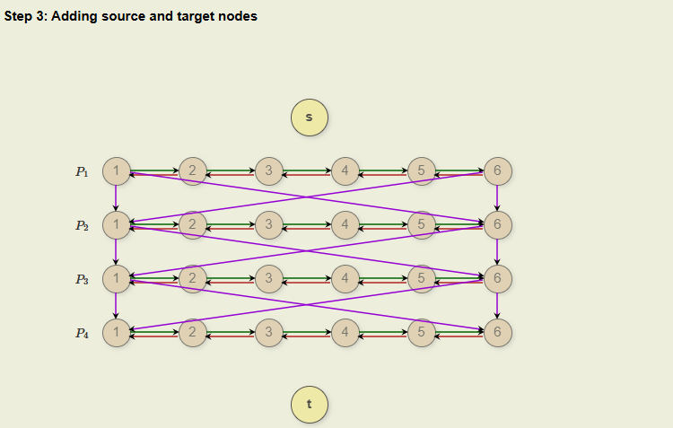
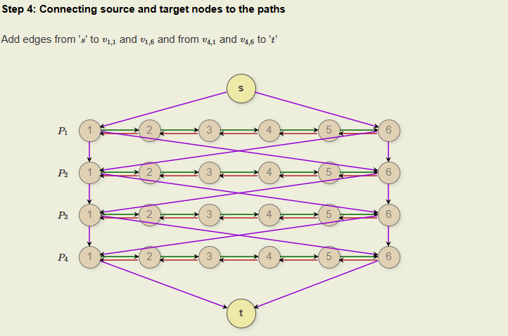
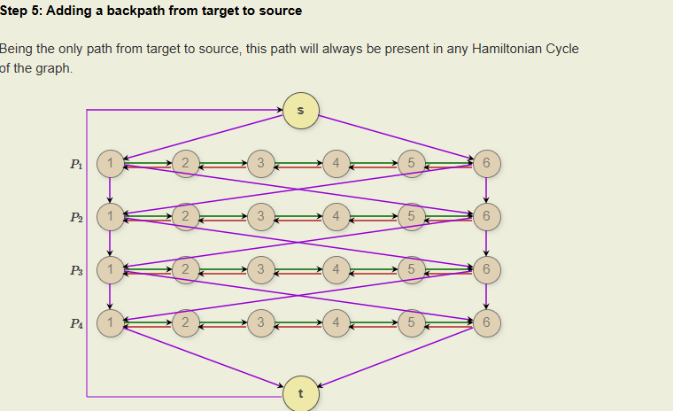
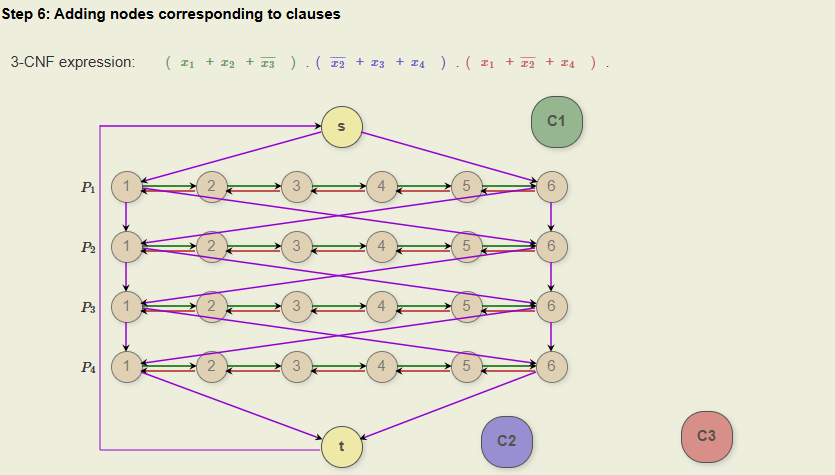
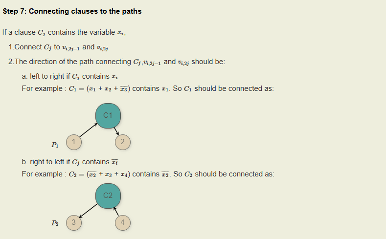
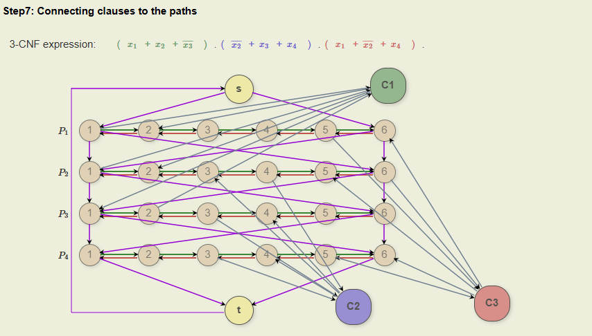

## 3SAT - Caminho Hamiltoniano

A demonstração de que o problema do caminho hamiltoniano é NP-completo envolve uma redução do problema 3-SAT, que é um problema também NP-completo. A redução é uma maneira de transformar qualquer instância do problema 3-SAT em uma instância do problema do caminho hamiltoniano de tal forma que a resposta para o problema 3-SAT seja "sim" se e somente se a resposta para o problema do caminho hamiltoniano correspondente também seja "sim".

**Redução do 3-SAT para Caminho Hamiltoniano:**

1. **Construção de Gadgets de Variáveis**:
   - Para cada variável no 3-SAT, construímos um "gadget" no grafo. Esse gadget terá dois caminhos possíveis, um representando a variável sendo verdadeira (true) e outro sendo falsa (false).
   - Esses caminhos são configurados para que só um possa ser escolhido, representando a atribuição de verdade à variável.

2. **Gadgets de Cláusulas**:
   - Para cada cláusula no 3-SAT, um vértice especial é criado no grafo do problema do caminho hamiltoniano.
   - Cada cláusula no 3-SAT é uma disjunção de três literais (por exemplo, $x \lor \neg y \lor z$). Para cada literal de uma cláusula, um link é feito do gadget da variável correspondente até o vértice da cláusula. Se o literal é positivo, o link vem do caminho que representa verdade; se negativo, do caminho que representa falso.

3. **Conexões entre Gadgets**:
   - Os gadgets são conectados de maneira sequencial e de modo que um caminho hamiltoniano só possa passar por todos se uma seleção consistente de caminhos verdadeiro/falso for feita em cada gadget de variável, e cada vértice de cláusula seja visitado (o que significa que cada cláusula foi satisfeita).

**Verificação e Conclusão**:
   - A configuração acima garante que um caminho hamiltoniano existe se e somente se houver uma maneira de atribuir valores às variáveis de modo que todas as cláusulas sejam satisfeitas. Isso transforma qualquer instância de 3-SAT em uma instância do problema do caminho hamiltoniano.
   - A redução é feita em tempo polinomial, pois o número de vértices e arestas no grafo construído é polinomialmente relacionado ao tamanho da fórmula 3-SAT.

Por fim, essa redução mostra que o problema do caminho hamiltoniano é NP-difícil. Como o problema também está em NP (verificar um caminho hamiltoniano dado como solução é feito em tempo polinomial), concluímos que é NP-completo.

## Demonstração em grafo OpenDSA Data Structures and Algorithms Modules Collection

- Solução obtida do site "Graph Hamiltonian Cycle Reduction" da coleção OpenDSA Data Structures and Algorithms Modules. [Link](https://opendsa-server.cs.vt.edu/ODSA/Books/Everything/html/threeSAT_to_hamiltonianCycle.html#)

### Passo 1: Construção de Caminhos
1. **Construir caminhos $P_1, P_2, ..., P_n$** para cada uma das n variáveis do problema 3SAT.
2. Cada caminho $P_i$ deve consistir de $2k$ nós, onde $k$ é o número de cláusulas no 3SAT, representados como $v_{i,1}, v_{i,2}, ... , v_{i,2k}$.

*Figura 1: Construção de Caminhos*

### Passo 1a: Adição de Nós para os Caminhos
- Adicionar nós numerados de 1 a 6 para cada caminho $P_i$, correspondendo a cada variável $x_i$.

*Figura 1a: Adição de Nós para os Caminhos*

### Passo 1b: Adição de Arestas nos Caminhos
- Adicionar arestas de $v_{i,j}$ para $v_{i,j-1}$ em cada $P_i$ para representar a atribuição $x_i = \text{False}$.

*Figura 1b: Adição de Arestas nos Caminhos*

### Passo 2: Interligação dos Caminhos
- Conectar o último nó de cada caminho $P_i$ ao primeiro nó do próximo caminho $P_{i+1}$, e vice-versa.

*Figura 2: Interligação dos Caminhos*

### Passo 3: Adição de Nós Fonte e Alvo
- Inserir nós especiais de fonte (s) e alvo (t).

*Figura 3: Adição de Nós Fonte e Alvo*

### Passo 4: Conectando Nós Fonte e Alvo aos Caminhos
- Conectar o nó fonte $s$ ao primeiro e último nó de $P_1 $ e o primeiro e último nó de $P_4 $ ao nó alvo $t$.

*Figura 4: Conectando Nós Fonte e Alvo aos Caminhos*

### Passo 5: Adição de um Caminho de Volta do Alvo para a Fonte
- Adicionar um caminho direto de $t$ para $s$, garantindo que sempre será parte de qualquer ciclo Hamiltoniano.

*Figura 5: Adição de um Caminho de Volta do Alvo para a Fonte*

### Passo 6: Adição de Nós Correspondentes às Cláusulas
- Introduzir nós representando cada cláusula $C_1, C_2, ..., C_k$ no 3SAT.

*Figura 6: Adição de Nós Correspondentes às Cláusulas*

### Passo 7: Conectando Cláusulas aos Caminhos
1. Conectar cada nó de cláusula $C_j$ aos nós $v_{i,2j-1}$ e $v_{i,2j}$ do caminho $P_i$ correspondente à variável $x_i$.
2. Direcionar as arestas dependendo se a cláusula contém $x_i$ ou $ \neg x_i$.

*Figura 7: Conectando Cláusulas aos Caminhos*

*Figura 7.1: Conectando Cláusulas aos Caminhos*

#### Estrutura dos Nós de Cláusulas:
Cada cláusula $C_j$ é representada por um nó no grafo. Este nó será conectado aos caminhos que correspondem às variáveis presentes na cláusula.

#### Conexão de Cláusulas:
1. **Seleção de Nós nos Caminhos**: Para cada variável $x_i$ que aparece na cláusula $C_j$, identificamos dois nós específicos nos caminhos:
   - $v_{i,2j-1}$: Este nó representa o ponto onde a cláusula começa a ter influência sobre a variável $x_i$.
   - $v_{i,2j}$: Este nó representa o ponto logo após $v_{i,2j-1}$ e indica a conclusão da influência da cláusula sobre a variável.

2. **Direcionamento das Arestas**:
   - **Aresta Direta (Esquerda para Direita)**: Se $C_j$ contém $x_i$ (ou seja, a variável sem negação), a aresta é adicionada de $C_j$ para $v_{i,2j-1}$ e de $v_{i,2j}$ para $C_j$. Isso simboliza que a cláusula é satisfeita se $x_i$ é verdadeiro.
   - **Aresta Inversa (Direita para Esquerda)**: Se $C_j$ contém $ \neg x_i$ (a negação da variável), a aresta é adicionada de $v_{i,2j-1}$ para $C_j$ e de $C_j$ para $v_{i,2j}$. Isso representa que a cláusula é satisfeita se $x_i$ é falso.

